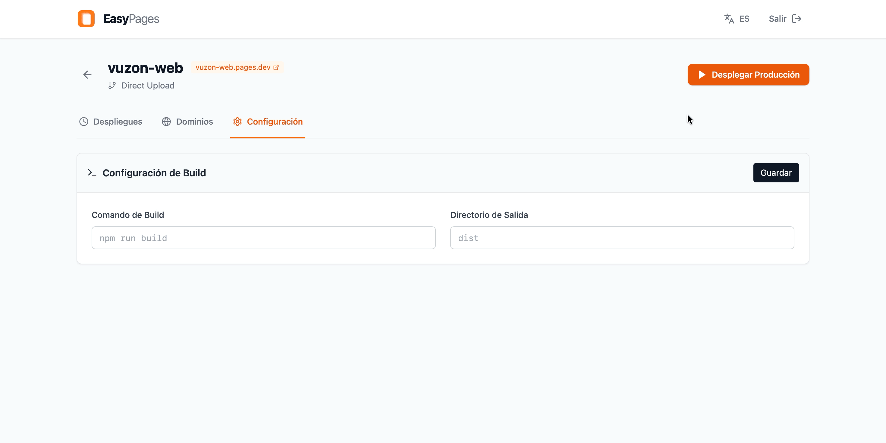

<p align="center">
  
</p>

<p align="center">
  <strong>
    <a href="#english">English</a>
    &nbsp;&nbsp;|&nbsp;&nbsp;
    <a href="#español">Español</a>
  </strong>
</p>

<br>

<p align="center">
  <a href="https://github.com/Kernel-Nomad/EasyPages/stargazers">
    
  </a>
  &nbsp;
  <a href="https://github.com/Kernel-Nomad/EasyPages/issues">
    
  </a>
  &nbsp;
  <a href="./LICENSE">
    
  </a>
  &nbsp;
  
</p>

<p align="center">
  
  &nbsp;
  
  &nbsp;
  
  &nbsp;
  
</p>

<p align="center">
  
</p>


<br>

<div id="english"></div>

# EasyPages

EasyPages is a minimalist self-hosted dashboard to manage your Cloudflare Pages projects from your own server.

## Features

* **Project Visualization**: List all your Cloudflare Pages sites.
* **Create Projects**: Basic option to create new projects and upload files locally (Direct Upload).
* **Deployments**: Trigger manual deployments directly from the interface.
* **Domains**: View associated domains and add new custom domains.
* **Configuration**: Update build settings and environment variables.

## Requirements

* Docker and Docker Compose.
* A Cloudflare account with an API Token.

### How to get your API Token

For EasyPages to work, you need a Cloudflare Token with the appropriate permissions.

1. Go to [Cloudflare Dashboard > My Profile > API Tokens](https://dash.cloudflare.com/profile/api-tokens).
2. Click on **Create Token**.
3. Select **Create Custom Token** (at the bottom of the list).
4. Configure the following permissions:
   * **Account** > **Cloudflare Pages** > **Edit**
5. Click **Continue to summary** and then **Create Token**.
6. Copy the generated token (it starts with `v4...` or similar). **You won't be able to see it again**.

## Quick Install

1.  **Configure Environment Variables**:
    Create a `.env` file in the project root based on your Cloudflare credentials:

    ```env
    # [https://dash.cloudflare.com/profile/api-tokens](https://dash.cloudflare.com/profile/api-tokens)
    CF_API_TOKEN=xxxxx
    CF_ACCOUNT_ID=xxxxx

    AUTH_USER=admin
    AUTH_PASS=password123

    SESSION_SECRET=2gcs1br2kf8dasjk8
    ```

2. **Configure docker-compose.yml**:

   ```yaml
   services:
     easypages:
       container_name: easypages
       image: ghcr.io/kernel-nomad/easypages
       restart: unless-stopped
       ports:
         - "8002:8002"
       env_file:
         - .env
       volumes:
         - ./sessions:/app/sessions
   
   ```

3. **Start the container**:
```bash
docker compose pull
docker compose up -d

```


4. **Access the application**:
Open your browser at `http://localhost:8002`.

## Local Development

To run the project without Docker (requires Node.js 18+):

1. Install dependencies:
```bash
npm install

```


2. Create the `.env` file as indicated above.
3. Start the server (this starts both backend and frontend):
```bash
npm start

```


---

<div id="español"></div>

# EasyPages

EasyPages es un panel de control minimalista para gestionar tus proyectos de Cloudflare Pages desde tu propio servidor (Self-Hosted).

## Características

* **Visualización de Proyectos**: Lista todos tus sitios de Cloudflare Pages.
* **Creación de nuevos proyectos**: Opción básica para crear nuevos proyectos y subir archivos localmente.
* **Despliegues**: Dispara implementaciones manualmente desde la interfaz.
* **Dominios**: Ve los dominios asociados y añadir nuevos.
* **Configuracion**: Actualiza la configuración del build.

## Requisitos

* Docker y Docker Compose.
* Una cuenta de Cloudflare con un API Token.

### Cómo obtener tu API Token

Para que EasyPages funcione, necesitas un Token de Cloudflare con los permisos adecuados.

1. Ve a [Cloudflare Dashboard > Mi Perfil > API Tokens](https://dash.cloudflare.com/profile/api-tokens).
2. Haz clic en **Create Token**.
3. Selecciona **Create Custom Token** (al final de la lista).
4. Configura los siguientes permisos:
* **Account** > **Cloudflare Pages** > **Edit**


5. Haz clic en **Continue to summary** y luego en **Create Token**.
6. Copia el token generado (empieza por `v4...` o similar). **No podrás verlo de nuevo**.

## Instalación Rápida

1. **Configura las variables de entorno**:
Crea un archivo `.env` en la raíz del proyecto basándote en tus credenciales de Cloudflare:
```env
# [https://dash.cloudflare.com/profile/api-tokens](https://dash.cloudflare.com/profile/api-tokens)
CF_API_TOKEN=xxxxx
CF_ACCOUNT_ID=xxxxx

AUTH_USER=admin
AUTH_PASS=password123

SESSION_SECRET=2gcs1br2kf8dasjk8

```


2. **Configura el docker-compose.yml**:
```yaml
services:
  easypages:
    container_name: easypages
    image: ghcr.io/kernel-nomad/easypages
    restart: unless-stopped
    ports:
      - "8002:8002"
    env_file:
      - .env
    volumes:
      - ./sessions:/app/sessions

```


3. **Inicia el contenedor**:
```bash
docker compose pull
docker compose up -d

```


4. **Accede a la aplicación**:
Abre tu navegador en `http://localhost:8002`.

## Desarrollo Local

Para ejecutar el proyecto sin Docker (requiere Node.js 18+):

1. Instala dependencias:
```bash
npm install

```


2. Crea el archivo `.env` como se indicó arriba.
3. Inicia el servidor (esto arranca tanto el backend como el frontend):
```bash
npm start

```
