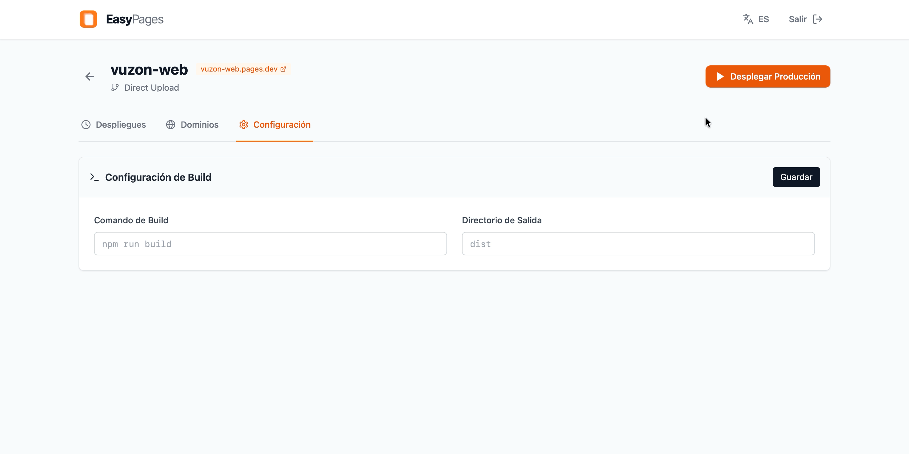

<p align="center">
  
</p>

<div align="center">
  <h3>
    <a href="#english">English</a> | <a href="#español">Español</a>
  </h3>
</div>

<br>

<p align="center">
  <a href="https://github.com/KN990x/EasyPages/stargazers">
    
  </a>
  &nbsp;
  <a href="https://github.com/KN990x/EasyPages/issues">
    
  </a>
  &nbsp;
  <a href="./LICENSE">
    
  </a>
  &nbsp;
  
</p>

<p align="center">
  
  &nbsp;
  
  &nbsp;
  
  &nbsp;
  
</p>

<p align="center">
  
</p>

<br>

<div id="english"></div>

# EasyPages

EasyPages is a self-hosted dashboard for managing Cloudflare Pages projects from your own server.

<a id="docker-install-recommended"></a>

## Docker install (recommended)

**You need:** Docker Compose and a Cloudflare API token that can edit Pages ([how to create it](#cloudflare-token-permissions)).

```bash
mkdir easypages && cd easypages
curl -fsSL -o docker-compose.yml https://raw.githubusercontent.com/KN990x/EasyPages/main/docker-compose.yml
curl -fsSL -o .env.example https://raw.githubusercontent.com/KN990x/EasyPages/main/.env.example
cp .env.example .env
# Edit .env — at minimum the four variables above
docker compose up -d --pull always
```

No git clone required. **Login over HTTP:** [`.env.example`](.env.example) sets `SESSION_COOKIE_SECURE=false`. If you terminate **HTTPS** in front of the container, set `SESSION_COOKIE_SECURE=true`. Session data is stored in a **signed cookie** (`easypages_sid`), not in a server-side session folder.

With a **reverse proxy**, keep the default **`TRUST_PROXY`** (one trusted hop for forwarded headers and rate limits). If the Node process is reachable **without** a trusted proxy in front, set **`TRUST_PROXY=false`** — see [runtime notes in CONTRIBUTING.md](CONTRIBUTING.md#runtime-notes-dist-sessions-scaling).

**From a git clone:** use the root [`docker-compose.yml`](docker-compose.yml) and [`.env.example`](.env.example) instead of `curl`.

More variables: [`.env.example`](.env.example). Compose ships a pinned GHCR image, `./easypages-data:/data`, and a healthcheck on `/login`. Releases and image tags: [CONTRIBUTING.md](CONTRIBUTING.md#releases-docker-image-and-compose).

## What it does

- Lists Cloudflare Pages projects.
- Creates new Direct Upload projects.
- Triggers deployments and shows recent deployment history.
- Uploads ZIP bundles for Direct Upload projects.
- Adds and removes custom domains.
- Lets you edit the current build command and output directory.
- Ships with a bilingual UI (`es` / `en`).

## Requirements

- **Docker path:** Docker and Docker Compose.
- **From source:** Node.js **24** or newer — see [For developers](#for-developers).

You also need a Cloudflare account and an API token with Pages access (below).

### Cloudflare token permissions

Create a custom Cloudflare API token with:

- `Account` → `Cloudflare Pages` → `Edit`

Token creation page: [Cloudflare Dashboard > My Profile > API Tokens](https://dash.cloudflare.com/profile/api-tokens)

---

## For developers

### Local development

Use **Node.js 24+** (same major as the Docker image and release CI). With [nvm](https://github.com/nvm-sh/nvm), run `nvm use` in the repo root (see [`.nvmrc`](.nvmrc)).

Install dependencies:

```bash
npm install
```

Create `.env` from [`.env.example`](.env.example). Set **`AUTH_PASS`** to a **bcrypt hash** of your password, or plain text for a minimal homelab setup (the server only treats values that look like bcrypt hashes as hashes).

For a production-like local run:

```bash
npm run build
npm run start
```

`npm run start` and `npm run dev` use `src/index.js`. `server.js` is a compatibility shim for tools that expect a root entrypoint.

Active development:

- `npm run dev` — Express on port `8002` (watch).
- `npm run dev:ui` — Vite on `5173`, proxies `/api`, `/login`, `/logout` to `http://localhost:8002`.

```bash
npm test
npm run check
```

### Technical details

Signed session cookie, where the signing key comes from (`EASYPAGES_DATA_DIR` file vs `SESSION_SECRET`), replicas, and how `dist/` is served: [CONTRIBUTING.md — Runtime notes](CONTRIBUTING.md#runtime-notes-dist-sessions-scaling). Repository layout: [CONTRIBUTING.md — Repository layout](CONTRIBUTING.md#repository-layout).

---

<div id="español"></div>

# EasyPages

EasyPages es un panel self-hosted para gestionar proyectos de Cloudflare Pages desde tu propio servidor.

<a id="docker-install-es"></a>

## Instalación con Docker (recomendado)

**Necesitas:** Docker Compose y un token de API de Cloudflare con permiso para editar Pages ([cómo crearlo](#permisos-del-token-de-cloudflare)).

```bash
mkdir easypages && cd easypages
curl -fsSL -o docker-compose.yml https://raw.githubusercontent.com/KN990x/EasyPages/main/docker-compose.yml
curl -fsSL -o .env.example https://raw.githubusercontent.com/KN990x/EasyPages/main/.env.example
cp .env.example .env
# Edita .env — como mínimo las cuatro variables de la plantilla
docker compose up -d --pull always
```

No hace falta clonar el repositorio. **Acceso por HTTP:** [`.env.example`](.env.example) deja `SESSION_COOKIE_SECURE=false`. Si terminas **HTTPS** delante del contenedor, pon `SESSION_COOKIE_SECURE=true`. Los datos de sesión van en una **cookie firmada** (`easypages_sid`), no en una carpeta de sesión en el servidor.

Con un **proxy inverso**, mantén el valor por defecto de **`TRUST_PROXY`** (un salto de confianza para cabeceras reenviadas y límites de peticiones). Si el proceso Node es alcanzable **sin** un proxy de confianza delante, define **`TRUST_PROXY=false`** — véanse las [notas de runtime en CONTRIBUTING.md](CONTRIBUTING.md#runtime-notes-dist-sessions-scaling).

**Con el repo clonado:** usa el [`docker-compose.yml`](docker-compose.yml) y [`.env.example`](.env.example) de la raíz en lugar de `curl`.

Más variables: [`.env.example`](.env.example). El Compose incluye una imagen fijada en GHCR, `./easypages-data:/data` y un healthcheck en `/login`. Releases y etiquetas de imagen: [CONTRIBUTING.md](CONTRIBUTING.md#releases-docker-image-and-compose).

## Qué hace

- Lista proyectos de Cloudflare Pages.
- Crea proyectos nuevos de tipo Direct Upload.
- Dispara despliegues y muestra el historial reciente.
- Sube paquetes ZIP para proyectos Direct Upload.
- Añade y elimina dominios personalizados.
- Permite editar el comando de build y el directorio de salida actuales.
- Incluye una UI bilingüe (`es` / `en`).

## Requisitos

- **Con Docker:** Docker y Docker Compose.
- **Desde código:** Node.js **24** o superior — ver [Para desarrolladores](#para-desarrolladores).

También necesitas una cuenta de Cloudflare y un token de API con acceso a Pages (apartado siguiente).

### Permisos del token de Cloudflare

Crea un token personalizado de API con:

- `Account` → `Cloudflare Pages` → `Edit`

Página de creación: [Cloudflare Dashboard > My Profile > API Tokens](https://dash.cloudflare.com/profile/api-tokens)

---

## Para desarrolladores

### Desarrollo local

Usa **Node.js 24+** (la misma major que la imagen Docker y el CI de releases). Con [nvm](https://github.com/nvm-sh/nvm), ejecuta `nvm use` en la raíz del repo (ver [`.nvmrc`](.nvmrc)).

Instala dependencias:

```bash
npm install
```

Crea `.env` desde [`.env.example`](.env.example). Configura **`AUTH_PASS`** con un **hash bcrypt** de tu contraseña, o texto plano en un homelab mínimo (el servidor solo interpreta bcrypt si el valor tiene forma de hash bcrypt).

Para una ejecución local parecida a producción:

```bash
npm run build
npm run start
```

`npm run start` y `npm run dev` usan `src/index.js`. `server.js` es un shim de compatibilidad para herramientas que esperan un entrypoint en la raíz.

Desarrollo activo:

- `npm run dev` — Express en el puerto `8002` (watch).
- `npm run dev:ui` — Vite en `5173`, hace proxy de `/api`, `/login`, `/logout` a `http://localhost:8002`.

```bash
npm test
npm run check
```

### Detalles técnicos

Cookie de sesión firmada, origen de la clave de firma (archivo bajo `EASYPAGES_DATA_DIR` frente a `SESSION_SECRET`), réplicas y cómo se sirve `dist/`: [CONTRIBUTING.md — Runtime notes](CONTRIBUTING.md#runtime-notes-dist-sessions-scaling). Estructura del repositorio: [CONTRIBUTING.md — Repository layout](CONTRIBUTING.md#repository-layout).
