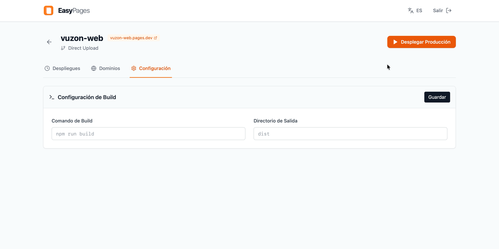

<p align="center">
  
</p>

<div align="center">
  <h3>
    <a href="#english">English</a> | <a href="#español">Español</a>
  </h3>
</div>

<br>

<p align="center">
  <a href="https://github.com/KN990x/EasyPages/stargazers">
    
  </a>
  &nbsp;
  <a href="https://github.com/KN990x/EasyPages/issues">
    
  </a>
  &nbsp;
  <a href="./LICENSE">
    
  </a>
  &nbsp;
  
</p>

<p align="center">
  
  &nbsp;
  
  &nbsp;
  
  &nbsp;
  
</p>

<p align="center">
  
</p>

<br>

<div id="english"></div>

# EasyPages

EasyPages is a self-hosted dashboard for managing Cloudflare Pages projects from your own server.

<a id="docker-install-recommended"></a>

## Docker install (recommended)

**You need:** Docker Compose and a Cloudflare API token that can edit Pages ([how to create it](#cloudflare-token-permissions)).

```bash
mkdir easypages && cd easypages
curl -fsSL -o docker-compose.yml https://raw.githubusercontent.com/KN990x/EasyPages/main/docker-compose.yml
curl -fsSL -o .env.example https://raw.githubusercontent.com/KN990x/EasyPages/main/.env.example
cp .env.example .env
# Edit .env — CF_API_TOKEN is the only required variable
docker compose up -d --pull always
```

Your account ID is not needed: it is inferred from the token, exactly as Cloudflare's own
SDK and Wrangler do. Set `CF_ACCOUNT_ID` only if the token can reach more than one account,
which is the one case inference cannot resolve — the server logs say so explicitly and list
the IDs to choose from.

Then open `http://your-server:8002` and **create your account in the browser**. That is the
whole setup: there is no user or password in `.env`, and no environment variable can create,
replace or bypass the account. Do it right away — until the account exists, anyone who can
reach the port can create it (see [SECURITY.md](SECURITY.md)).

No git clone required. **Login over HTTP:** [`.env.example`](.env.example) sets `SESSION_COOKIE_SECURE=false`, and Compose interpolates that file into the container (`${SESSION_COOKIE_SECURE:-false}`). If you terminate **HTTPS** in front of the container, set `SESSION_COOKIE_SECURE=true` in `.env`. Session data is stored in a **signed cookie** (`easypages_sid`), not in a server-side session folder.

Compose defaults **`TRUST_PROXY=false`** for a published HTTP port (clients can send `X-Forwarded-For`). With a **reverse proxy**, set **`TRUST_PROXY=1`** in `.env` (one trusted hop). See [runtime notes in CONTRIBUTING.md](CONTRIBUTING.md#runtime-notes-dist-sessions-scaling).

**From a git clone:** use the root [`docker-compose.yml`](docker-compose.yml) and [`.env.example`](.env.example) instead of `curl`.

More variables: [`.env.example`](.env.example). Compose ships a pinned GHCR image, `./easypages-data:/data`, and a healthcheck on `/api/health`. Your account and the session secret live in that volume; the container runs as uid 1000, so if you created the directory as root run `chown -R 1000:1000 ./easypages-data`. Releases and image tags: [CONTRIBUTING.md](CONTRIBUTING.md#releases-docker-image-and-compose).

## What it does

- Lists Cloudflare Pages projects.
- Creates new Direct Upload projects.
- Triggers deployments and shows recent deployment history.
- Uploads ZIP bundles for Direct Upload projects.
- Adds and removes custom domains.
- Lets you edit the current build command and output directory.
- Ships with a bilingual UI (`es` / `en`).

## Requirements

- **Docker path:** Docker and Docker Compose.
- **From source:** Node.js **24** or newer — see [For developers](#for-developers).

You also need a Cloudflare account and an API token with Pages access (below).

### Cloudflare token permissions

Create a custom Cloudflare API token with:

- `Account` → `Cloudflare Pages` → `Edit`

That single permission is enough — the account ID is read from the token itself, so you do
not have to look it up.

Token creation page: [Cloudflare Dashboard > My Profile > API Tokens](https://dash.cloudflare.com/profile/api-tokens)

---

## For developers

### Local development

Use **Node.js 24+** (same major as the Docker image and release CI). With [nvm](https://github.com/nvm-sh/nvm), run `nvm use` in the repo root (see [`.nvmrc`](.nvmrc)).

This project uses **pnpm**, pinned in `packageManager`. Corepack picks up the right version
on its own, so you get the same pnpm as CI and the Docker image:

```bash
corepack enable
pnpm install --frozen-lockfile
```

Create `.env` from [`.env.example`](.env.example) with your Cloudflare token — that is the
only required variable. There is nothing to configure for the operator account: the first time you open the app it shows the
setup wizard. Local data (credential and session secret) goes to `./data` by default.

For a production-like local run:

```bash
pnpm run build
pnpm start
```

`pnpm start` and `pnpm run dev` use `src/index.js`. `server.js` is a compatibility shim for
tools that expect a root entrypoint.

Active development:

- `pnpm run dev` — Express on port `8002` (watch).
- `pnpm run dev:ui` — Vite on `5173`, proxies `/api`, `/login`, `/logout` to `http://localhost:8002`.

```bash
pnpm run lint
pnpm test          # backend (node:test) + frontend (vitest); run `pnpm run build` first
```

There is a `Makefile` with the same targets (`make setup`, `make dev`, `make lint`,
`make test`, `make clean-data`).

### Forgot your password?

There is no reset email. Stop the app, delete the credential file and start again — the
wizard comes back:

```bash
docker compose down
rm ./easypages-data/credentials.json
docker compose up -d
```

From a git clone the file is at `./data/credentials.json` (or `make clean-data`).

### Technical details

Signed session cookie, where the signing key comes from (`EASYPAGES_DATA_DIR` file vs `SESSION_SECRET`), replicas, and how `dist/` is served: [CONTRIBUTING.md — Runtime notes](CONTRIBUTING.md#runtime-notes-dist-sessions-scaling). Repository layout: [CONTRIBUTING.md — Repository layout](CONTRIBUTING.md#repository-layout).

---

<div id="español"></div>

# EasyPages

EasyPages es un panel self-hosted para gestionar proyectos de Cloudflare Pages desde tu propio servidor.

<a id="docker-install-es"></a>

## Instalación con Docker (recomendado)

**Necesitas:** Docker Compose y un token de API de Cloudflare con permiso para editar Pages ([cómo crearlo](#permisos-del-token-de-cloudflare)).

```bash
mkdir easypages && cd easypages
curl -fsSL -o docker-compose.yml https://raw.githubusercontent.com/KN990x/EasyPages/main/docker-compose.yml
curl -fsSL -o .env.example https://raw.githubusercontent.com/KN990x/EasyPages/main/.env.example
cp .env.example .env
# Edita .env — CF_API_TOKEN es la única variable obligatoria
docker compose up -d --pull always
```

El account ID no hace falta: se deduce del token, igual que hacen el SDK oficial de
Cloudflare y Wrangler. Solo tendrás que definir `CF_ACCOUNT_ID` si el token da acceso a más
de una cuenta, que es el único caso que la deducción no puede resolver — los logs del
servidor lo dicen y listan los identificadores entre los que elegir.

Después abre `http://tu-servidor:8002` y **crea tu cuenta en el navegador**. Eso es toda la
configuración: no hay usuario ni contraseña en el `.env`, y ninguna variable de entorno puede
crear, sustituir ni saltarse la cuenta. Hazlo enseguida: hasta que la cuenta exista, cualquiera
que llegue a ese puerto puede crearla (ver [SECURITY.md](SECURITY.md)).

No hace falta clonar el repositorio. **Acceso por HTTP:** [`.env.example`](.env.example) deja `SESSION_COOKIE_SECURE=false`, y Compose interpola ese archivo en el contenedor (`${SESSION_COOKIE_SECURE:-false}`). Si terminas **HTTPS** delante del contenedor, pon `SESSION_COOKIE_SECURE=true` en `.env`. Los datos de sesión van en una **cookie firmada** (`easypages_sid`), no en una carpeta de sesión en el servidor.

Compose deja **`TRUST_PROXY=false`** por defecto en un puerto HTTP publicado (el cliente puede enviar `X-Forwarded-For`). Con un **proxy inverso**, pon **`TRUST_PROXY=1`** en `.env` (un salto de confianza). Véanse las [notas de runtime en CONTRIBUTING.md](CONTRIBUTING.md#runtime-notes-dist-sessions-scaling).

**Con el repo clonado:** usa el [`docker-compose.yml`](docker-compose.yml) y [`.env.example`](.env.example) de la raíz en lugar de `curl`.

Más variables: [`.env.example`](.env.example). El Compose incluye una imagen fijada en GHCR, `./easypages-data:/data` y un healthcheck en `/api/health`. Tu cuenta y el secreto de sesión viven en ese volumen; el contenedor corre como uid 1000, así que si creaste la carpeta como root ejecuta `chown -R 1000:1000 ./easypages-data`. Releases y etiquetas de imagen: [CONTRIBUTING.md](CONTRIBUTING.md#releases-docker-image-and-compose).

## Qué hace

- Lista proyectos de Cloudflare Pages.
- Crea proyectos nuevos de tipo Direct Upload.
- Dispara despliegues y muestra el historial reciente.
- Sube paquetes ZIP para proyectos Direct Upload.
- Añade y elimina dominios personalizados.
- Permite editar el comando de build y el directorio de salida actuales.
- Incluye una UI bilingüe (`es` / `en`).

## Requisitos

- **Con Docker:** Docker y Docker Compose.
- **Desde código:** Node.js **24** o superior — ver [Para desarrolladores](#para-desarrolladores).

También necesitas una cuenta de Cloudflare y un token de API con acceso a Pages (apartado siguiente).

### Permisos del token de Cloudflare

Crea un token personalizado de API con:

- `Account` → `Cloudflare Pages` → `Edit`

Con ese permiso basta: el identificador de cuenta se lee del propio token, así que no tienes
que buscarlo.

Página de creación: [Cloudflare Dashboard > My Profile > API Tokens](https://dash.cloudflare.com/profile/api-tokens)

---

## Para desarrolladores

### Desarrollo local

Usa **Node.js 24+** (la misma major que la imagen Docker y el CI de releases). Con [nvm](https://github.com/nvm-sh/nvm), ejecuta `nvm use` en la raíz del repo (ver [`.nvmrc`](.nvmrc)).

Este proyecto usa **pnpm**, fijado en `packageManager`. Corepack resuelve la versión correcta
por su cuenta, así que usas el mismo pnpm que el CI y que la imagen Docker:

```bash
corepack enable
pnpm install --frozen-lockfile
```

Crea `.env` desde [`.env.example`](.env.example) con tu token de Cloudflare, que es la única
variable obligatoria. La cuenta de operador no se configura en ningún sitio: la primera vez que abras la aplicación verás el
asistente. Los datos locales (credencial y secreto de sesión) van a `./data` por defecto.

Para una ejecución local parecida a producción:

```bash
pnpm run build
pnpm start
```

`pnpm start` y `pnpm run dev` usan `src/index.js`. `server.js` es un shim de compatibilidad
para herramientas que esperan un entrypoint en la raíz.

Desarrollo activo:

- `pnpm run dev` — Express en el puerto `8002` (watch).
- `pnpm run dev:ui` — Vite en `5173`, hace proxy de `/api`, `/login`, `/logout` a `http://localhost:8002`.

```bash
pnpm run lint
pnpm test          # backend (node:test) + frontend (vitest); ejecuta antes `pnpm run build`
```

Hay un `Makefile` con los mismos objetivos (`make setup`, `make dev`, `make lint`,
`make test`, `make clean-data`).

### ¿Has perdido la contraseña?

No hay correo de recuperación. Detén la aplicación, borra el fichero de credenciales y
arranca de nuevo: vuelve el asistente.

```bash
docker compose down
rm ./easypages-data/credentials.json
docker compose up -d
```

Con el repo clonado el fichero está en `./data/credentials.json` (o `make clean-data`).

### Detalles técnicos

Cookie de sesión firmada, origen de la clave de firma (archivo bajo `EASYPAGES_DATA_DIR` frente a `SESSION_SECRET`), réplicas y cómo se sirve `dist/`: [CONTRIBUTING.md — Runtime notes](CONTRIBUTING.md#runtime-notes-dist-sessions-scaling). Estructura del repositorio: [CONTRIBUTING.md — Repository layout](CONTRIBUTING.md#repository-layout).
